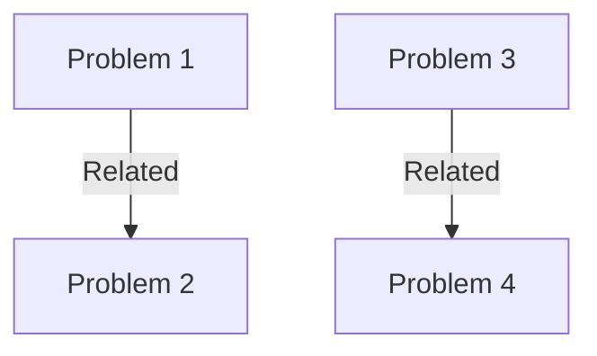
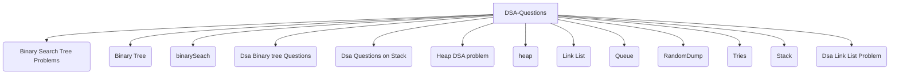

# DSA-Questions

A collection of Data Structures and Algorithms (DSA) problems implemented in C++.

[](https://github.com/Rudra2637/DSA-Questions)
[](https://github.com/Rudra2637/DSA-Questions)


## 📚 Table of Contents

- [Description](#description)
- [Tech Stack](#tech-stack)
- [Architecture Overview](#architecture-overview)
- [File Structure](#file-structure)
- [Features](#features)
- [Installation](#installation)
  - [Prerequisites](#prerequisites)
  - [Setup](#setup)
- [Contributors](#contributors)
- [License](#license)


## Description

This project is a collection of C++ solutions to various Data Structures and Algorithms problems.  It focuses on providing clear, concise, and well-tested implementations for common DSA challenges. The primary use case is to serve as a learning resource and a reference for practicing DSA concepts.  The unique value lies in the comprehensive coverage of problems across different data structures like Binary Trees, Binary Search Trees, Heaps, Stacks, Queues, and Linked Lists.  Many solutions utilize classes like `Solution`, `Node`, `TreeNode`, and `BinaryTreeNode` to encapsulate problem-solving logic.


## Tech Stack

[](https://www.cplusplus.com/)
[](https://github.com/PIYUSH1SAINI/ReadMe-wiz.git)


## Architecture Overview

The project's architecture is straightforward, focusing on individual problem solutions.  There isn't a complex interconnected system. Each C++ file represents a solution to a specific DSA problem.




## File Structure




## Features

*   Comprehensive coverage of DSA problems across various data structures.
*   Well-structured C++ code with clear comments.
*   Individual solutions for each problem, allowing for focused learning.
*   Organized directory structure for easy navigation.
*   Utilizes common data structure classes for consistent implementation patterns.


## Installation

### Prerequisites

> [!NOTE]
> A C++ compiler (like g++) is required to compile and run the code.


### Setup

1. **Clone Repository**: This is the recommended method.

   ```bash
   git clone https://github.com/Rudra2637/DSA-Questions.git
   cd DSA-Questions
   ```

   Then compile the individual `.cpp` files using a C++ compiler (like g++). For example:

   ```bash
   g++ BinarySearchTreeProblems/Code\ Testcase\ Testcase\ Test\ Result\ 108.\ Convert\ Sorted\ Array\ to\ Binary\ Search\ Tree.cpp -o 108
   ```


## Contributors

<a href="https://github.com/Rudra2637" target="_blank"></a>


## License

MIT License


<a href="https://github.com/PIYUSH1SAINI/ReadMe-wiz.git" target="_blank">
      
    </a>
